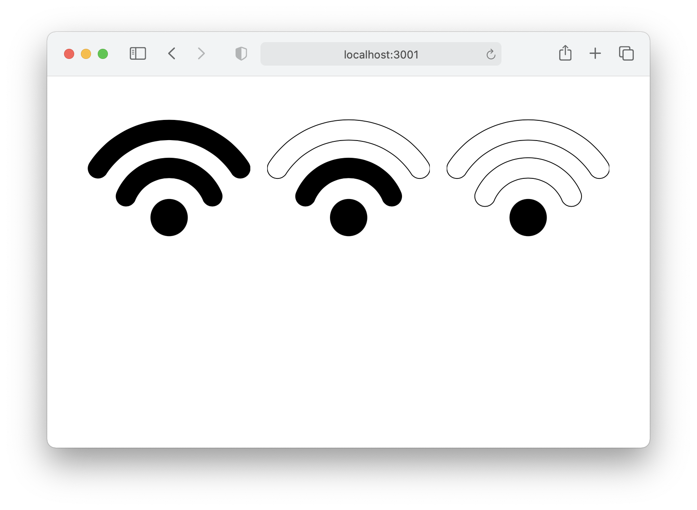

# react-stock

A library of React component for stock level indication with configurable params.

## Installation

Run the following command:
`npm install --save @jgornati/react-stock`

## Usage

```
import {Indicator} from "@jgornati/react-stock-indicator";
```
## Example

```
<Indicator style={{fill: "red", width: "15px"}}
                       stock={20}
                       config={{
                           low: 3,
                           high: 15
                       }}
/>
```

